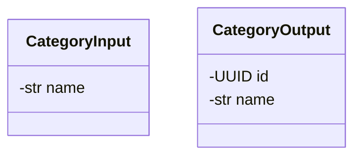
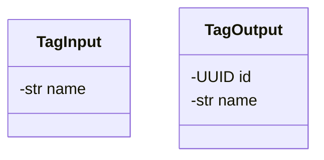
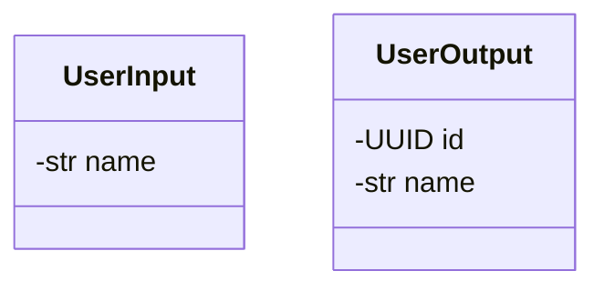
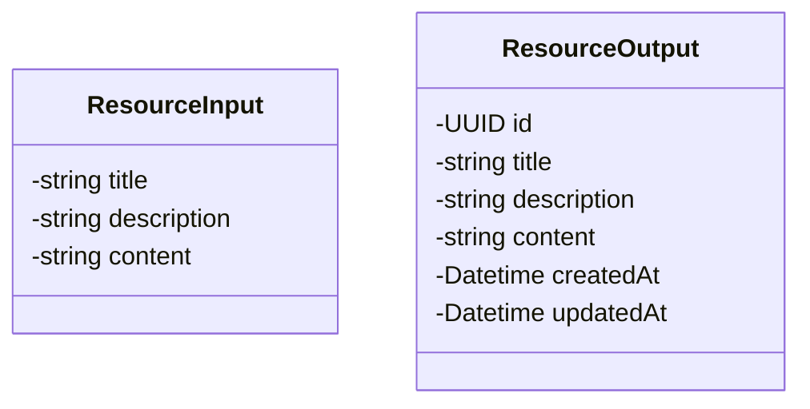

# Class diagrams

## Category DTOs

```mermaid
classDiagram
class CategoryInput {
    -str name
}

class CategoryOutput {
    -UUID id
    -str name
}
```

## Tag DTOs

```mermaid
classDiagram
class TagInput {
    -str name
}

class TagOutput {
    -UUID id
    -str name
}
```

## User DTOs

```mermaid
classDiagram
class UserInput {
    -str name
}

class UserOutput {
    -UUID id
    -str name
}
```

## Resource DTOs

```mermaid
classDiagram
class ResourceInput {
    -string title
    -string description
    -string content
}

class ResourceOutput {
    -UUID id
    -string title
    -string description
    -string content
    -Datetime createdAt
    -Datetime updatedAt
}
```
