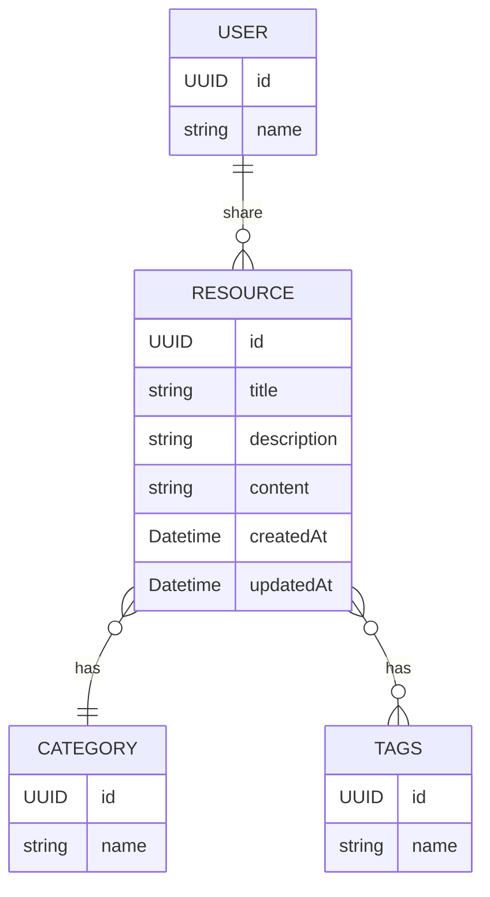

# Entity Relationship Diagram

```mermaid
erDiagram
USER {
    UUID id
    string name
}

RESOURCE {
    UUID id
    string title
    string description
    string content
    Datetime createdAt
    Datetime updatedAt
}

CATEGORY {
    UUID id
    string name
}

TAGS {
    UUID id
    string name
}

USER ||--o{ RESOURCE : share
RESOURCE }o--|| CATEGORY : has
RESOURCE }o--o{ TAGS : has
```
