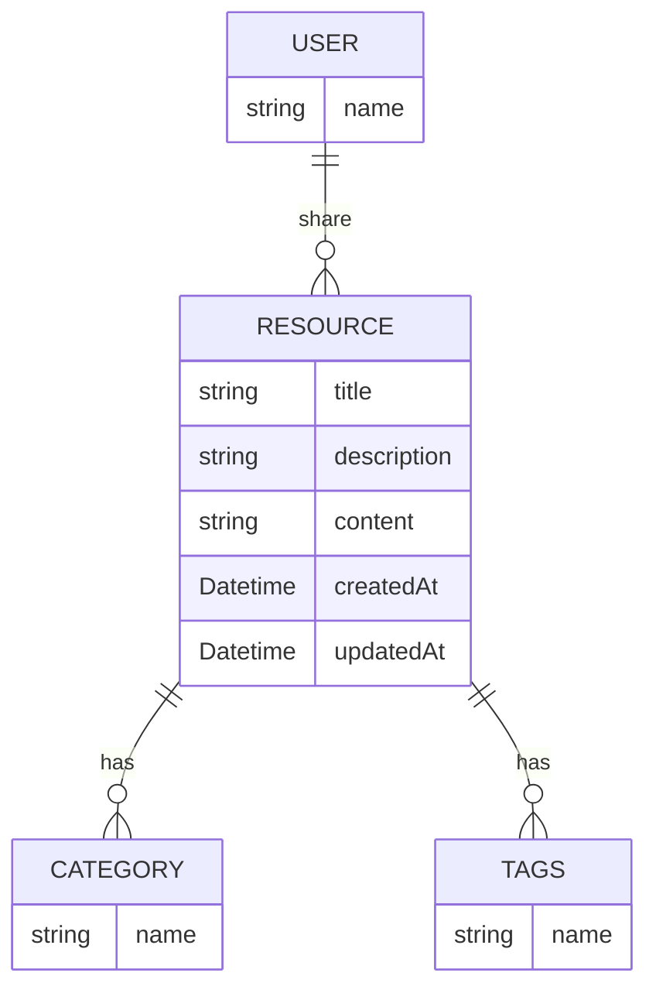

```mermaid
erDiagram
USER {
    string name
}

RESOURCE {
    string title
    string description
    string content
    Datetime createdAt
    Datetime updatedAt
}

CATEGORY {
    string name
}

TAGS {
    string name
}

USER ||--o{ RESOURCE : share
RESOURCE ||--o{ CATEGORY : has
RESOURCE ||--o{ TAGS : has
```
